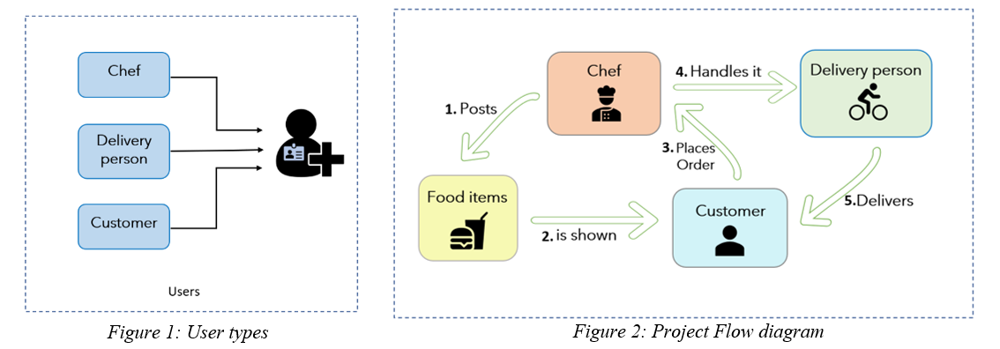
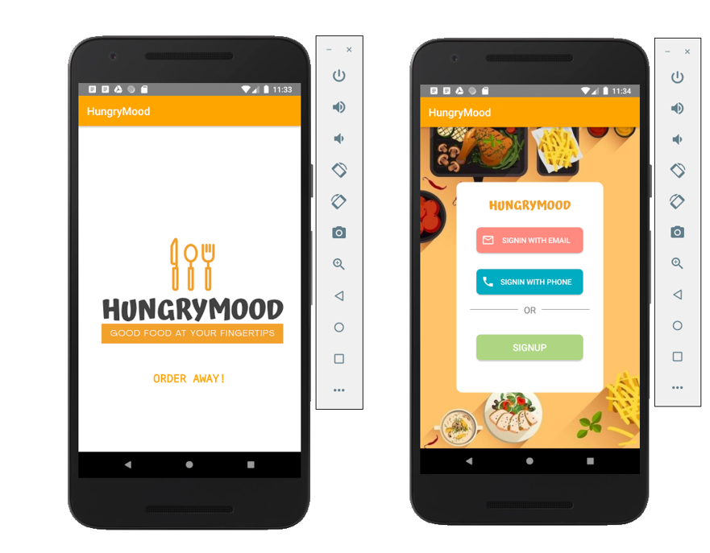
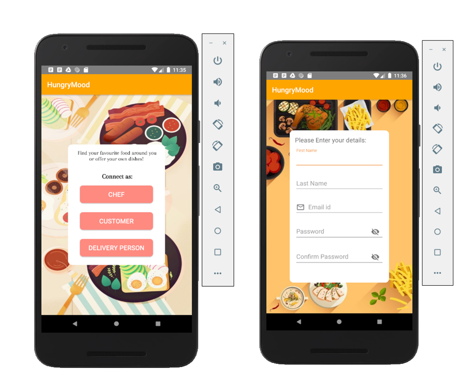
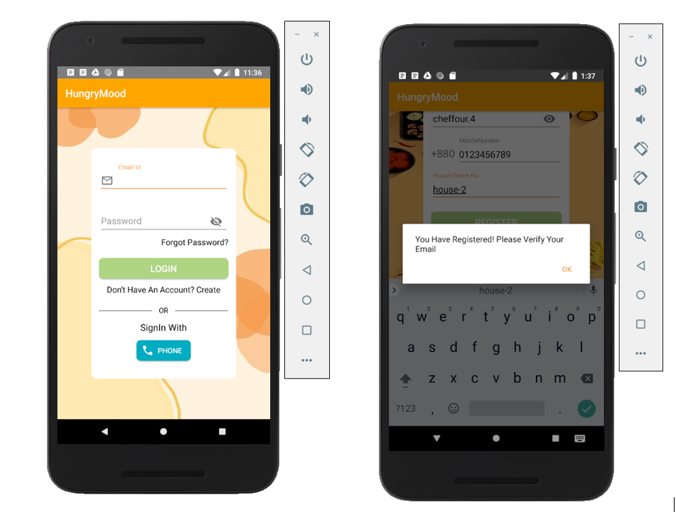
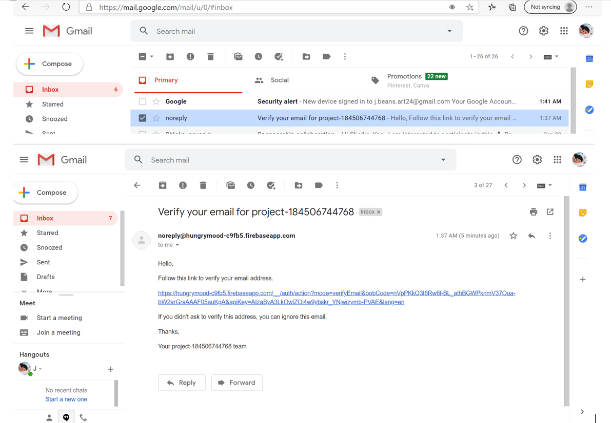
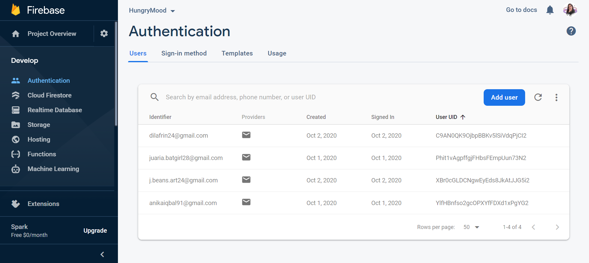

# HungryMood
HungryMood is an ongoing work for online food delivery system.

The main scope of this project is to make the customers’ and also the chefs’ life easier by providing instant food deliveries with the help the of this app. It is a platform where the professional chefs and skilled home-cooks will offer services to the customers food cravings and needs with the help of the delivery person to bring their food to the proper destinations. 
1.  The task of a chef is to post their menu with pictures and proper details in the app which will be shown to the customers.
2.	The customer will be able to decide and select their desired food items and the chef will be notified after the customer confirms the order.
3.	The chef will have the choice to decline or accept the order.
4.	If the order is accepted, the chef will handle the menu and the nearest delivery person will be notified of this order. 
5.	The order status will be shown to the customer after the chefs handles the item to the delivery person.

An Overall diagram of the system is described in the flow diagram below:

Our app offers three variations of registration to form the connections in the app, they are:
•	Connect as chef
•	Connect as Customer
•	Connect as Delivery Person.

After the registration is done:
- the user will be notified with verification link in their registered email id to proceed with the login and using the app successfully as a chef,customer or delivery person.

The database of the users are stored in firebase database like so:

