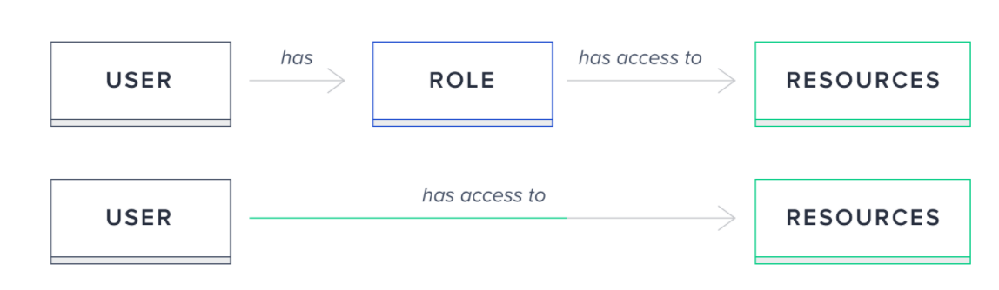
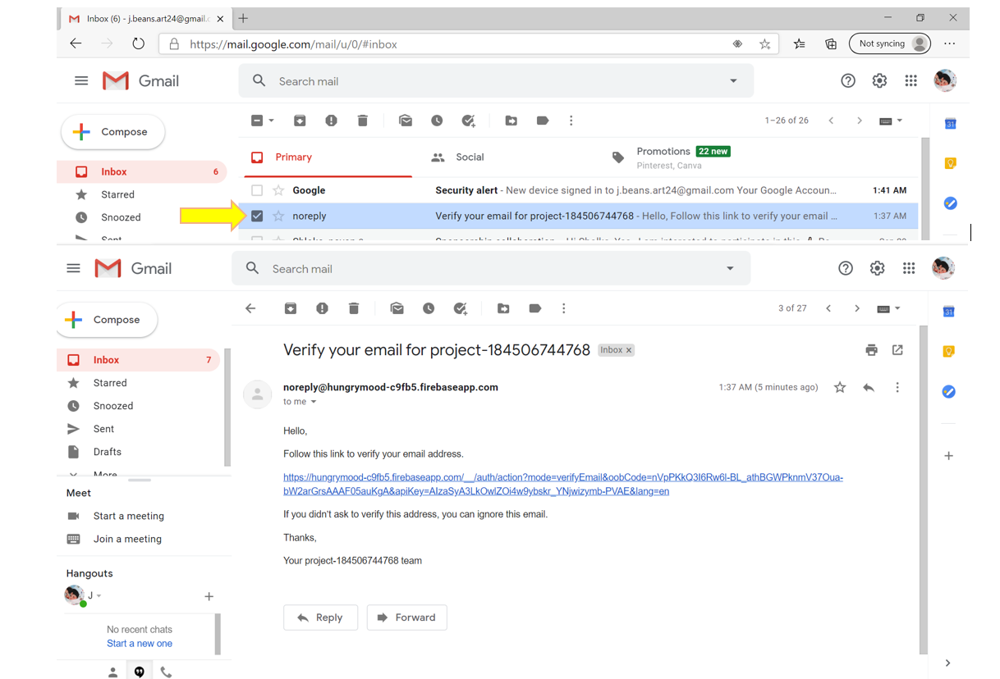
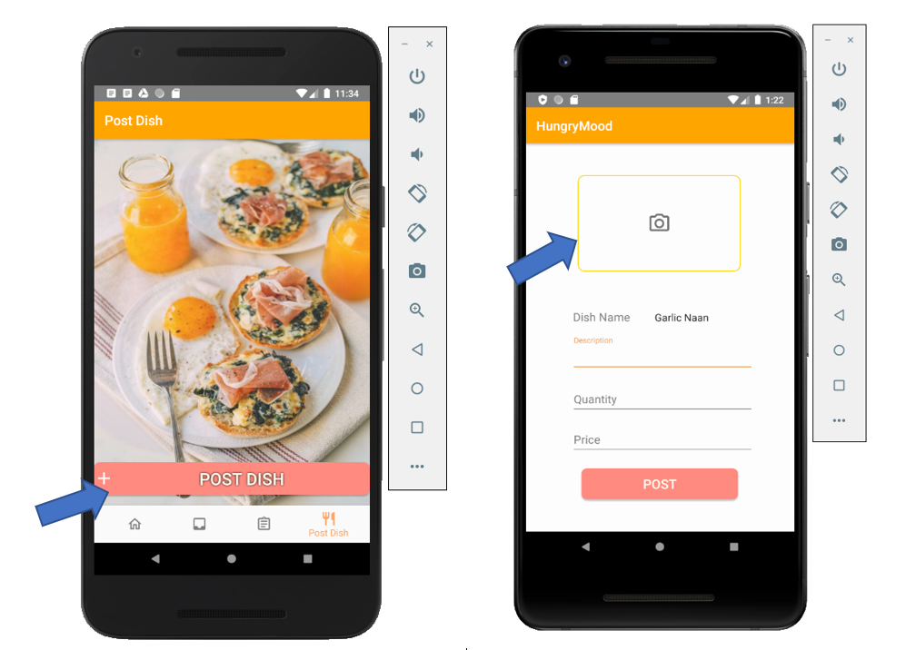
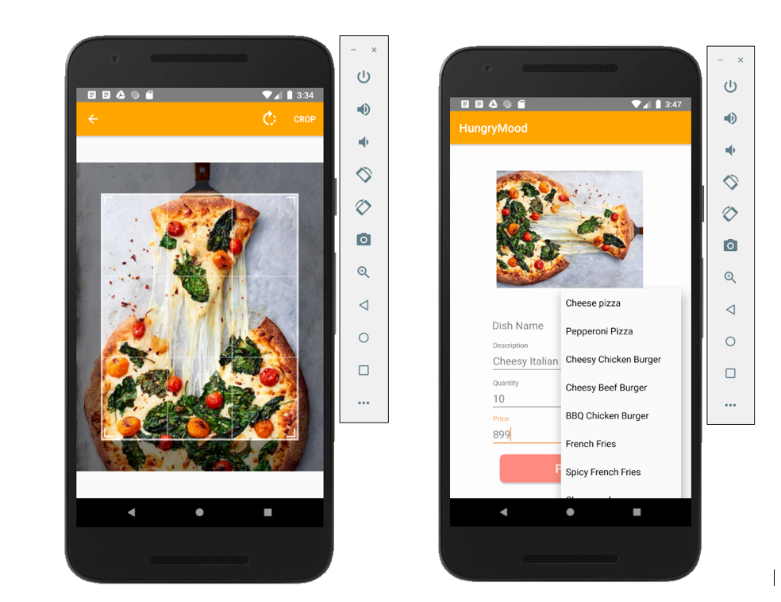
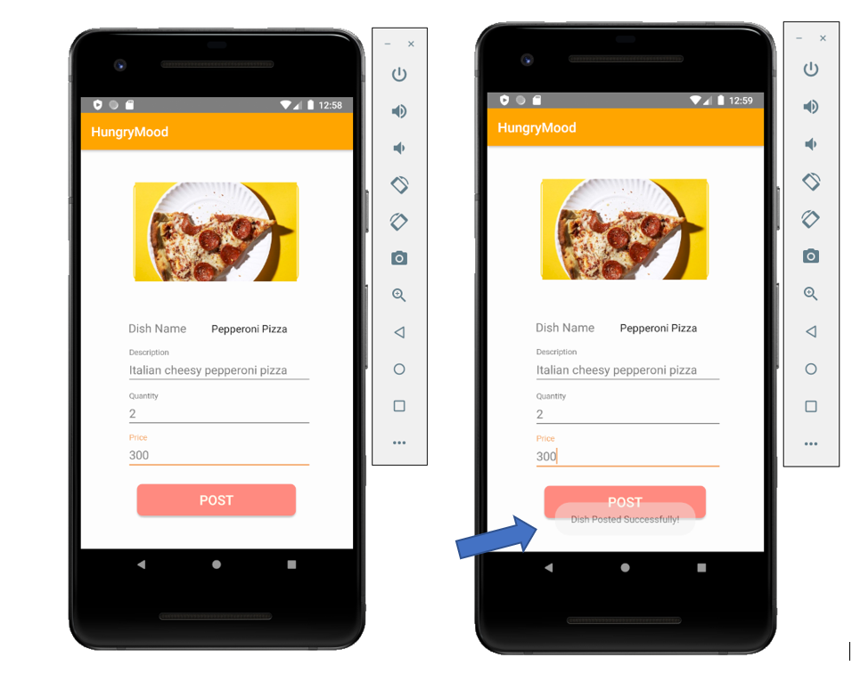
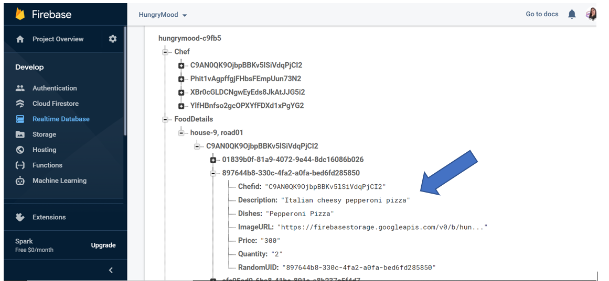

# HungryMood
HungryMood is an ongoing work for online food delivery system.

The main scope of this project is to make the customers’ and also the chefs’ life easier by providing instant food deliveries with the help the of this app. It is a platform where the professional chefs and skilled home-cooks will offer services to the customers food cravings and needs with the help of the delivery person to bring their food to the proper destinations. 
1.  The task of a chef is to post their menu with pictures and proper details in the app which will be shown to the customers.
2.	The customer will be able to decide and select their desired food items and the chef will be notified after the customer confirms the order.
3.	The chef will have the choice to decline or accept the order.
4.	If the order is accepted, the chef will handle the menu and the nearest delivery person will be notified of this order. 
5.	The order status will be shown to the customer after the chefs handles the item to the delivery person.

An Overall diagram of the system is described in the flow diagram below:

This app offers three variations of registration to form the connections in the app, they are:
•	Connect as chef
•	Connect as Customer
•	Connect as Delivery Person.

These three users are identified as three different roles in the firebase database. Refer to the systematic diagram below to get the gist of the "role" type works in firebase.

After the registration is done, the user will be notified with verification link in their registered email id to proceed with the login and using the app successfully as a chef,customer or delivery person.

This project currently uses Firebase database to store all the information. To prevent a sign-in link from being used to sign in as an unintended user or on an unintended device, Firebase Auth requires the user's email address to be provided when completing the sign-in flow. For sign-in to succeed, this email address must match the address to which the sign-in link was originally sent.
The database of the users are stored in firebase database like so:

Now, the main role of chef is to upload images and decription of their food item so that the users can view and select them. Firwebase storage and camera authentication have been implemented to do this part shown below.

While uploading an image, the user has the flexibity to crop and rotate the images as per their likings which is shown in the screenshots below:

After the chef successfully uploads the image and descriptions of the dish, it will be stored in the firebase database under the registered chef or restaurant ID and their descriptions like the image given below.

Future works:
More features of chef, customer and food delivery system and will be implemented very soon.

